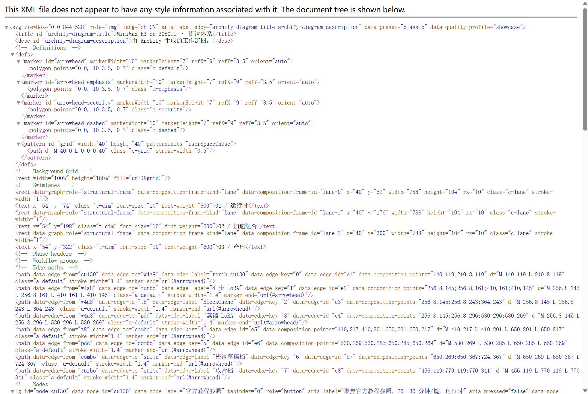
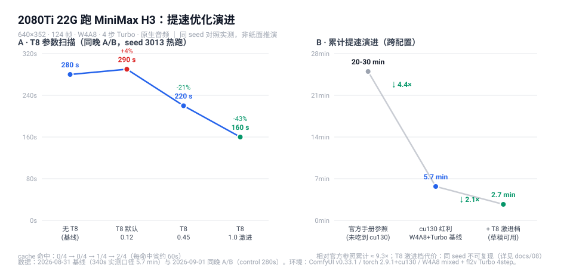

# minimax-h3-turing

**在 2080Ti 22G 魔改卡（Turing / sm_75）上跑通 MiniMax H3 本地视频生成的实测手册。**

全部结论来自真实产线运行，非纸面推演。所有 Turing（sm_75）显卡适用——2080Ti 22G / 11G 均可参考，显存越接近 22G 越接近本文配置。

## 提速体系全景

一条主路径：官方教程参照（20–30 分钟/镜）→ cu130 反量化 + W4A8 → Turbo / T8 / PDD 三条加速支线 → **PDD+T8 组合（210s，命中 6/8）** → 五件套工作流。可交互版本：[speed-system.html](docs/assets/speed-system.html)（暗/亮主题、节点聚焦；源文件 `speed-system.workflow.json`，由 [Archify](https://github.com/tt-a1i/archify) 渲染）。

同一条 5 秒视频：官方教程的一般环境要 **20–30 分钟/镜**，本手册路线压到 **4.7 分钟（成片标准）/ 2.7 分钟（草稿快跑）/ 3.5 分钟（PDD+T8 极速草稿）**，**快 5–11 倍**。逐档耗时对比：

（条形图由 `scripts/gen_speed_chart.py` 生成，数据口径见 [08](docs/08-t8-blockcache-4step.md)/[09](docs/09-pdd-backport.md)）

## 这个仓库能给你什么

- ✅ **可直接导入的四件套工作流**（t2v/i2v 各配成片档 + T8 草稿快跑档），全部真机实测、附预览截图——见 [workflows/README](workflows/README.md)
- ✅ **13 条踩坑 FAQ**：v3 节点提交 400、同 seed 重跑失灵、空闲自退灭批、杀软拖慢 27 分钟、prompt_id 静默丢弃……每条都是真金白银踩出来的 → [06](docs/06-faq.md)
- ✅ **提速路线判决全景**：SageAttention 崩溃全过程、T8 BlockCache −43% 实测、TE-Speed 永久排除——哪些路能走、哪些路死了，不用你再试一遍
- ✅ **A/B 实测方法论**：同 seed 对照脚本拿来就能跑自己的实验 → [scripts/](scripts/)

## 增效路线图

### ✅ Phase 1 · 先跑通 —— 选对唯一可行的量化路线

- [x] 硬件账：sm_75 无 BF16/FP8 张量核心、带宽 616 GB/s，天花板先算清 → [01](docs/01-hardware-limits.md)
- [x] 量化判决：**DiT 必须 INT8（W4A8）**，W4A4 误差 18 倍、彩色撕裂 → [02](docs/02-w4a8-vs-w4a4.md)
- [x] compat 降级版工作流（当时 T8 节点不可用），`workflows/` 直接可导入

### ✅ Phase 2 · 跑得稳 —— 稳定性是提速的前提

- [x] 启动参数防 TDR 黑屏 / OOM：`--reserve-vram 2.5 --vram-headroom 0.5 --disable-pinned-memory` → [scripts/](scripts/)
- [x] 杀软实时防护拖慢模型加载 27 分钟 → 跑前关跑后开 + 断点续跑兜底 → [06](docs/06-faq.md)
- [x] prompt_id 去重、队列残留、大文件下载等 10 个坑清障 → [06](docs/06-faq.md)
- [x] 分辨率补足：640×352 生成 → RTX VSR 抽帧超分 1080p（47ms/帧）

### ✅ Phase 3 · 提速研究 —— 每条路都试到出判决为止

- [x] **cu130 反量化红利**：kitchen CUDA 后端满血启用——这正是 5.7 分钟 vs 官方 20–30 分钟的根因，老 torch 用户先查运行时再怀疑显卡 → [01](docs/01-hardware-limits.md)
- [x] SageAttention：Triton INT8 内核 sm_75 全版本编译失败；CUDA 内核孤立能跑、接管线原生崩溃 → **判死**，已完整回滚 → [03](docs/03-sageattention-crash.md)
- [x] TE-Speed：短步数下语义崩坏 → **永久排除**，等新版也救不回来 → [06](docs/06-faq.md)
- [x] **T8 BlockCache 真机实测：激进档 −43% = 2.7 分钟/镜**；纠正「需 ComfyUI ≥0.34」误判（v0.33.1 即可用）；默认参数在 4 步路线上 0 命中属负优化；代价 = 同 seed 不可复现 → 草稿用、成片不用 → [08](docs/08-t8-blockcache-4step.md)

### ✅ Phase 4 · 提速终局 —— PDD 不等官方，自己移植落地（9-03）

- [x] **PDD LoRA master backport**（不等 v0.34.1+）：单文件不够→全量升级三坑全解（comfy_api 盲区/PyAV/T8 签名）→ **PDD 8步 600s 可复现 + PDD8+T8 组合 210s（-34%）命中 6/8** → [09](docs/09-pdd-backport.md)
- [x] T8 节点 master 兼容补丁（FinalLayer 7 参签名自适应），待回馈上游
- [ ] PDD vs Turbo 成片画质盲测；Ref2VA（i2v）版 PDD 待测

### 💡 Phase 5 · 观望池

- [ ] H3 Max（fal.ai 联合后训练版）：**API 专属无开源权重**，本地不可用；关键镜头可付费走 API，本地党等开源跟进 → [07](docs/07-upgrade-watch.md)

## 文档目录

| 文档 | 内容 |
|---|---|
| [01 硬件先天限制](docs/01-hardware-limits.md) | sm_75 缺什么、带宽差距、cu130 红利、为什么 W4A8 是唯一路线 |
| [02 量化路线实测](docs/02-w4a8-vs-w4a4.md) | W4A4 vs W4A8 误差数据、产线速度、社区同款卡成绩 |
| [03 SageAttention 崩溃实录](docs/03-sageattention-crash.md) | 2.2.0 wheel 接入管线崩溃 → 定位 → 回滚验证全过程 |
| [04 社区经验验证](docs/04-community-tips.md) | 可直接抄的三点 + 适用条件 |
| [05 工作流说明](docs/05-workflows.md) | compat t2v/i2v 工作流导入与占位符替换 |
| [06 踩坑 FAQ](docs/06-faq.md) | 13 条：v3 节点 400、同 seed 失灵、空闲自退、杀软拖慢、prompt_id 去重、TE-Speed 排除、音频削波 |
| [07 升级窗口追踪](docs/07-upgrade-watch.md) | 提速路线判决全景、v0.34 评估、PDD LoRA #15908、T8 官方开源 |
| [08 T8 四步实测](docs/08-t8-blockcache-4step.md) | 43% 提速实测：默认参数零命中、激进档 2.7 分钟/镜、同 seed 复现性代价 |
| [09 PDD 提前落地](docs/09-pdd-backport.md) | 不等 release 的 master backport 实录：PDD8+T8 组合 **210s（-34%）命中 6/8**，三坑全解 |
| [workflows/](workflows/README.md) | 五件套（附预览截图）：t2v/i2v × 成片/草稿 + PDD 极速档，含导入指南 |
| [scripts/](scripts/) | 防黑屏启动参数、T8 A/B 实验、图表再生脚本 |

## 复现环境

- GPU：2080Ti 22G 魔改（Turing，sm_75）
- ComfyUI：v0.33.1（H3 W4A8 路线已内置原生 AV 采样修复）
- 路线：h3lite W4A8 compat + fl2v Turbo 4step LoRA（T8 草稿档可选，见 [08](docs/08-t8-blockcache-4step.md)）

## 双平台镜像

| 平台 | 地址 |
|---|---|
| Gitee（主站） | https://gitee.com/IvenKooLab/minimax-h3-turing |
| GitHub | https://github.com/IvenKooLab/minimax-h3-turing |

两边内容自动同步（Gitee 为权威源）。Issue/PR 请到 Gitee。

## License

MIT
